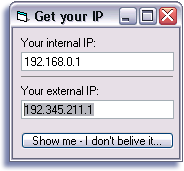



## Get your external xDSL IP

### Description

Just a little module, which gets the true internet-ip. Works great with xDSL. And its not "winsock.localip" ^^ - Just test it and tell me, if it works for you too.
 
### More Info
 

             |
---                |---
**Submitted On**   |2002-10-10 15:03:04
**By**             |[Ninnghizidha](https://github.com/Planet-Source-Code/PSCIndex/blob/master/ByAuthor/ninnghizidha.md)
**Level**          |Intermediate
**User Rating**    |4.2 (21 globes from 5 users)
**Compatibility**  |VB 5\.0, VB 6\.0
**Category**       |[Internet/ HTML](https://github.com/Planet-Source-Code/PSCIndex/blob/master/ByCategory/internet-html__1-34.md)
**World**          |[Visual Basic](https://github.com/Planet-Source-Code/PSCIndex/blob/master/ByWorld/visual-basic.md)
**Archive File**   |[Get\_your\_e14403010102002\.zip](https://github.com/Planet-Source-Code/ninnghizidha-get-your-external-xdsl-ip__1-39713/archive/master.zip)

